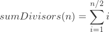

# Números Perfectos

## Enunciado

Se desea hacer un programa que realice las siguiente operaciones:
- Leer el archivo [numbers](numbers.csv) que contiene n números.
- Implementar una función que determine si un número es perfecto o no (debe ser compatible con la firma de los hilos).
- Crear un hilo por cada número leído, el hilo debe verificar si el número es perfecto con la función anterior.
- Mostrar los números que son perfectos..

## Ayuda

- Un número perfecto es aquel que es igual a la suma de sus divisores propios positivos. Ejemplos:
  - 6 es perfecto porque 6 = 1 + 2 + 3
  - 28 es perfecto porque 28 = 1 + 2 + 4 + 7 + 14
  - 496 es perfecto porque 496 = 1 + 2 + 4 + 8 + 16 + 31 + 62 + 124 + 248

- Un número “i” es divisor propio de “n” si se cumple que “i” es divisor de “n” y además “i” es diferente de “n”.

- Para obtener la suma de los divisores propios de un número “n”, puede ayudarse conceptualmente con la siguiente expresión:

  >  <br> Para todo “i” tal que “N” mod “i”  es igual a 0.

## Compilación

```
gcc -Wall perfect.c -o perfect.out
```

## Ejecución

```
./perfect.out numbers.csv
```

## Resultado

```
6 es un número perfecto
28 es un número perfecto
8128 es un número perfecto
```